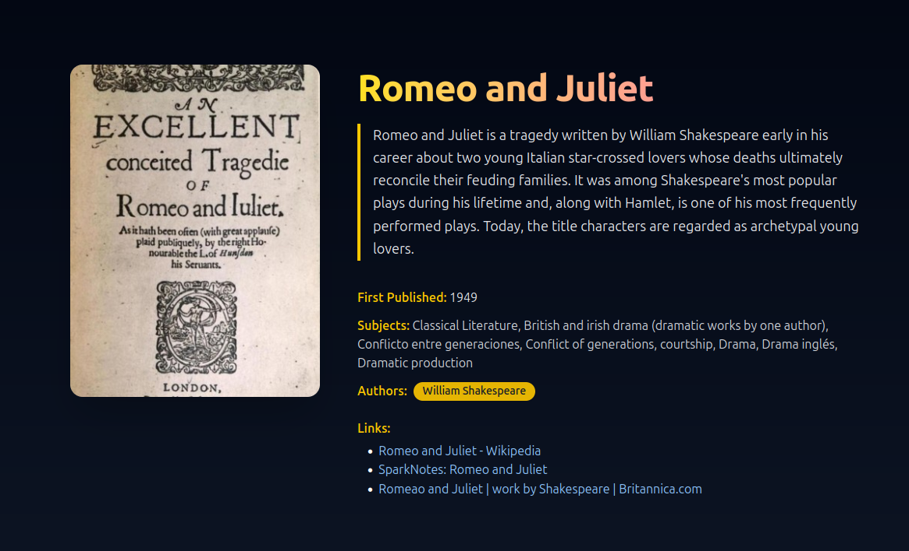

# 📚 Book Explorer

**Book Explorer** is a modern, responsive React web app that allows users to search for and explore books using the [Open Library API](https://openlibrary.org/developers/api). With a sleek UI built using **Tailwind CSS**, users can search books by title, author, or keyword and view detailed information about each book.

## ✨ Features

- 🔍 **Search functionality** for books by title, author, or keyword
- 🖼️ Beautiful **book cards** with cover images and author details
- 📖 **Detailed book pages** with descriptions, subjects, authors, and links
- 💅 Clean, responsive **UI with Tailwind CSS**
- ⚡ Fast client-side routing using `react-router-dom`
- 🔁 Initial fetch of "bestsellers" on homepage load
- 🌙 Dark-themed layout with subtle gradients and animations
- 🦾 Loading states, graceful error handling, and fallback UI

---

## 🛠️ Tech Stack

- **Vite** – Fast build tool for modern web apps
- **React** – Frontend UI library
- **Tailwind CSS** – Utility-first CSS framework
- **React Router DOM** – Client-side routing
- **Open Library API** – Free public API for books data

---

## 🚀 Getting Started

### 1. Clone the repo

```bash
git clone https://github.com/martian58/book-explorer.git
cd book-explorer
````

### 2. Install dependencies

```bash
npm install
```

### 3. Start the development server

```bash
npm run dev
```

Open [http://localhost:5173](http://localhost:5173) to view the app in your browser.

---

## 📂 Project Structure

```bash
book-explorer/
├── public/               # Static files (e.g. favicon)
├── src/
│   ├── components/
│   │   ├── Book.jsx      # Book card component
│   │   └── Footer.jsx    # Sticky footer
│   ├── pages/
│   │   ├── Home.jsx      # Homepage with search and results
│   │   └── BookDetail.jsx# Book detail page
│   ├── App.jsx           # Routing config
│   └── main.jsx          # React root
├── index.html
└── vite.config.js
```

---

## 🖼️ Screenshots

### 🔎 Home Page

> Hero section with gradient title and search bar.  
> Dynamically updated book grid. Fully responsive with smooth animations.

<p align="center">
  
</p>

---

### 📘 Book Detail

> Displays cover image, title, description, subjects, and authors.  
> Authors fetched dynamically with clean badges and external links.

<p align="center">
  
</p>

---

## 🔗 API Used

* **Open Library Search API**:
  `https://openlibrary.org/search.json?q=...`

* **Open Library Works API**:
  `https://openlibrary.org/works/{id}.json`

* **Book Cover Images**:
  `https://covers.openlibrary.org/b/id/{cover_id}-L.jpg`

---

## 💡 Future Ideas

* 📌 Add user bookmarks or reading lists
* 🌐 Filter by genre or language
* 🔖 Pagination and infinite scroll
* 🗣️ Add user reviews (via external API)

---

## 📄 License

This project is open source and available under the [MIT License](LICENSE).

---

## 🙌 Acknowledgements

* [Open Library](https://openlibrary.org) for their awesome public API
* [Tailwind CSS](https://tailwindcss.com) for the styling magic
* [Heroicons](https://heroicons.com/) for icons

